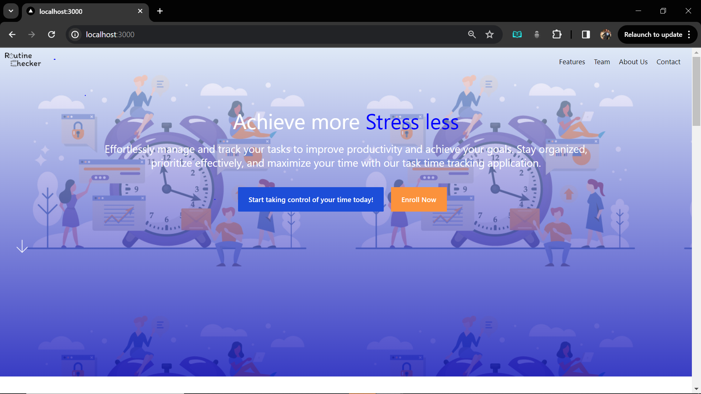

# RoutineChecker Pro
Routine Checker sets itself apart by focusing on personal productivity and goal achievement, with a unique emphasis on the Pomodoro technique and small business task delegation. By reimagining these features in a unified app, Routine Checker aims to provide a tailored solution for its target user base.
 



## Getting Started
First, run the development server:

```bash
npm run dev
# or
yarn dev
# or
pnpm dev
# or
bun dev
```

## Help
Open [http://localhost:3000](http://localhost:3000) with your browser to see the result.

You can start editing the page by modifying `pages/index.tsx`. The page auto-updates as you edit the file.

This project uses [`next/font`](https://nextjs.org/docs/basic-features/font-optimization) to automatically optimize and load Inter, a custom Google Font.

## Learn More
To learn more about Next.js, take a look at the following resources:

- [Next.js Documentation](https://nextjs.org/docs) - learn about Next.js features and API.
- [Learn Next.js](https://nextjs.org/learn) - an interactive Next.js tutorial.

You can check out [the Next.js GitHub repository](https://github.com/vercel/next.js/) - your feedback and contributions are welcome!

# Contributors
- [Chibuike Cletus Nwafor](https://github.com/ConquerorCletus)
- [Azeez Tiamiyu](https://github.com/hertheyhermee)
- [Kimberly Peters]()
- [Aisha Adewoyin](https://github.com/Aishat452)


# Becoming a Collaborator.
1. Fork the repository.
2. Create a branch named 'fix' to make adjustment or 'Features' to add a new feature.
3. Push the branch to your forked repository.
4. Submit a Pull request detailing the Change you made. 


## Deploy on Vercel

The easiest way to deploy your Next.js app is to use the [Vercel Platform](https://vercel.com/new?utm_medium=default-template&filter=next.js&utm_source=create-next-app&utm_campaign=create-next-app-readme) from the creators of Next.js.

Check out our [Next.js deployment documentation](https://nextjs.org/docs/deployment) for more details.
